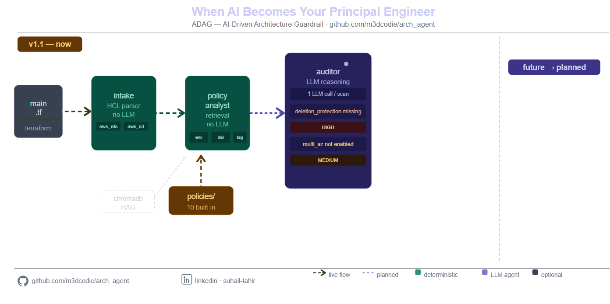

# ADAG — AI-Driven Architecture Guardrail

[](LICENSE)


A multi-agent AI system that acts as a **virtual principal engineer** — scanning Terraform infrastructure-as-code against your organisation's policy standards and returning intelligent, actionable audit results.

Built to explore and demonstrate: **LangGraph** · **Multi-Agent Systems** · **RAG** · **MCP** · **LLM Provider Abstraction**



---

## Table of Contents

- What it does
- Key Features
- Quick Start
- RAG Mode
- MCP Server
- Running Tests
- Documentation
- License

## What it does

ADAG reads your `.tf` files, checks them against 10 built-in compliance policies (or your own), and reports violations with remediation hints. It runs as a CLI tool, a Python library, or an MCP server that any AI assistant can call.

```bash
pip install adag
adag scan ./infra/
```

```
File: infra/database.tf  |  Resources: 3  |  Violations: 2

[HIGH]   aws_db_instance / main        → delete_protection: missing deletion_protection = true
[MEDIUM] aws_db_instance / main        → multi_az_requirement: multi_az not enabled

Status: FAILED  (exit code 1)
```

## Key Features

- **Multi-agent graph** — three specialised agents (Intake, Policy Analyst, Auditor) orchestrated by LangGraph
- **Deterministic parsing** — the HCL parser (`core/hcl_parser.py`) never calls an LLM; regex extraction eliminates false positives from hallucinated attribute values. All resource types present in the Terraform file are extracted and passed to the policy analyst and auditor — no hardcoded filter list
- **10 built-in policies** — deletion protection, encryption at rest, public access block, multi-AZ, backup retention, KMS key rotation, allowed regions, required tagging, naming conventions
- **Five LLM providers** — AWS Bedrock, GitHub Models, GitHub Copilot (IDE), HuggingFace, Ollama (fully local); all support **per-agent model selection** (`INTAKE_MODEL`, `AUDITOR_MODEL`) so you can use a fast small model for parsing and a powerful reasoning model for policy judgement
- **Three output formats** — human-readable text, JSON, SARIF 2.1.0 (GitHub Advanced Security)
- **MCP server** — any MCP-compatible AI assistant (Claude Desktop, VS Code Copilot) can call ADAG as a tool
- **RAG mode** — index your internal architecture docs and query them semantically at scan time
- **CI/CD ready** — exit codes 0/1/2 and SARIF upload supported. Add a GitHub Actions workflow under `.github/workflows/` to enable CI (I can add a minimal workflow if you want).

Model mapping and recommended model choices are documented in `llms.txt` at the repository root. Update that file when you change models.

## Quick Start

### 1. Install

```bash
pip install adag
```

### 2. Configure an LLM provider

**GitHub Models (recommended — works with any GitHub Copilot subscription):**

1. Create a fine-grained PAT at <https://github.com/settings/personal-access-tokens/new>
   - Under **Account permissions**, enable:
     - **GitHub Copilot** → Read
     - **Models** → Read
2. Copy the token (starts with `github_pat_…`)

```ini
# .env
LLM_PROVIDER=github-models
GITHUB_MODELS_TOKEN=github_pat_your_token_here
GITHUB_MODELS_MODEL=openai/gpt-4.1
```

**AWS Bedrock:**

```ini
# .env
LLM_PROVIDER=bedrock
AWS_PROFILE=default
AWS_REGION=us-east-1
BEDROCK_MODEL=anthropic.claude-sonnet-4-5-20250929-v1:0
```

Or use cross-region inference profiles (check availability in your region):

```ini
# .env — inference profile example
LLM_PROVIDER=bedrock
AWS_PROFILE=default
AWS_REGION=ap-southeast-2
BEDROCK_MODEL=au.anthropic.claude-sonnet-4-5-20250929-v1:0
```

**Ollama (fully local, no API key):**

```bash
ollama pull deepseek-r1:8b
```

```ini
# .env
LLM_PROVIDER=ollama
OLLAMA_MODEL=deepseek-r1:8b
```

**HuggingFace (free serverless inference):**

```ini
# .env
LLM_PROVIDER=huggingface
HF_TOKEN=hf_your_token_here
HF_MODEL=Qwen/Qwen2.5-72B-Instruct
```

#### Per-agent model selection (all providers)

ADAG applies the [LLM Capability Framework (LCF)](https://github.com/m3dcodie/LLM-Capability-Framework-LCF) to match each agent to the right model tier. Not every step in a multi-agent system needs the same depth of reasoning — assigning the wrong tier wastes cost and latency:

| Agent       | LCF Layer           | Task                                                         | Recommended model size                         |
| ----------- | ------------------- | ------------------------------------------------------------ | ---------------------------------------------- |
| **Intake**  | L1 — The Scout      | Deterministic structured JSON extraction from Terraform HCL  | 4B–14B distilled (fast, instruction-following) |
| **Auditor** | L3 — The Strategist | Policy gap analysis, compliance judgement, remediation hints | 14B–70B logic-heavy (reasoning depth)          |

Set `INTAKE_MODEL` and `AUDITOR_MODEL` independently to use the right tier for each job:

```ini
# .env — GitHub Models example
LLM_PROVIDER=github-models
GITHUB_MODELS_TOKEN=github_pat_your_token_here

INTAKE_MODEL=openai/gpt-4o-mini             # fast — structured JSON extraction
AUDITOR_MODEL=openai/gpt-4.1               # powerful — policy reasoning
```

```ini
# .env — AWS Bedrock example
LLM_PROVIDER=bedrock
AWS_PROFILE=default
AWS_REGION=us-east-1

INTAKE_MODEL=anthropic.claude-haiku-4-5-sonnet:0     # fast — distilled model
AUDITOR_MODEL=anthropic.claude-sonnet-4-5-20250929-v1:0  # powerful — reasoning model
```

```ini
# .env — HuggingFace example
LLM_PROVIDER=huggingface
HF_TOKEN=hf_your_token_here
HF_MODEL=Qwen/Qwen2.5-72B-Instruct     # default fallback for any agent

INTAKE_MODEL=Qwen/Qwen2.5-7B-Instruct          # fast — structured JSON extraction
AUDITOR_MODEL=Qwen/Qwen2.5-72B-Instruct        # powerful — policy reasoning
```

```ini
# .env — Ollama example
LLM_PROVIDER=ollama
OLLAMA_MODEL=deepseek-r1:8b             # default fallback

INTAKE_MODEL=qwen2.5:7b                 # fast local model
AUDITOR_MODEL=deepseek-r1:32b           # stronger reasoning model
```

If `INTAKE_MODEL` or `AUDITOR_MODEL` are unset, both agents use the provider default.

### 3. Scan

`adag scan` accepts **one path** — either a single `.tf` file or a directory. When given a directory, it scans **all `.tf` files recursively** (including subdirectories). It does not accept multiple paths in a single call.

```
your-repo/
├── infra/
│   ├── main.tf          ← scanned
│   ├── variables.tf     ← scanned
│   └── modules/
│       └── rds/
│           └── main.tf  ← scanned (recursive)
```

````bash
# Single file — useful when you only want to check one resource
adag scan ./infra/main.tf

# Directory — scans all .tf files recursively (most common in CI)
adag scan ./infra/

# Multiple separate folders — run once per folder
adag scan ./infra/networking/
adag scan ./infra/databases/

# JSON output
adag scan ./infra/ --format json

# SARIF for GitHub Advanced Security
adag scan ./infra/ --format sarif > results.sarif

# Use a custom policies folder instead of the built-in bundle
adag scan ./infra/ --policies-dir ./my-org-policies/

You can also set the policies directory via the POLICIES_DIR environment variable (useful for MCP server or CI):

```ini
# in your .env
POLICIES_DIR=./my-org-policies
````

Copy the example template to create a working .env and edit it for your environment:

```bash
cp .env.example .env
# then edit .env and set POLICIES_DIR or other provider variables
```

See docs/CONFIGURATION.md and the project's .env.example for a full list of environment variables and provider configuration.

# Fully offline — skip RAG even if USE_RAG=true in .env

adag scan ./infra/ --no-rag

```

---

## Three Operating Modes

| Mode              | How                                    | When                                      |
| ----------------- | -------------------------------------- | ----------------------------------------- |
| **CLI / Package** | `pip install adag && adag scan`        | CI/CD pipelines, local dev                |
| **MCP Server**    | `python -m adag.mcp_server`            | Claude Desktop, VS Code Copilot           |
| **Advanced RAG**  | `USE_RAG=true` + running microservices | 500+ policies, internal architecture docs |

---

## RAG Mode — Querying Your Own Architecture Standards

By default ADAG loads all policies from the `policies/` directory into the LLM's context window. This works well for small-to-medium policy sets (up to ~100 docs) and requires no infrastructure.

**RAG (Retrieval-Augmented Generation) mode** adds a vector database layer. Instead of sending every policy to the LLM, ADAG embeds the Terraform resource descriptions, performs a semantic similarity search against the stored policies, and sends only the most relevant chunks to the Auditor. This enables two things that context-window loading cannot do:

1. **Scale beyond context limits** — hundreds or thousands of policy documents without hitting token limits
2. **Query non-policy sources** — ingest your Confluence pages, Architecture Decision Records, Mermaid diagrams, or internal runbooks; the Auditor can reason against them the same way

### How it works

```

Your docs (Confluence, ADRs, Markdown)
│
▼
Ingest → Chunk → Embed → ChromaDB ← one-time indexing
│
Scan time: │
Terraform resource description
│
▼
Semantic query → top-k relevant policy chunks
│
▼
Auditor LLM (sees only what's relevant, not everything)

````

### When you need RAG

| Scenario                                   | RAG needed?                          |
| ------------------------------------------ | ------------------------------------ |
| Built-in 10 policies                       | No — context window is sufficient    |
| Custom `policies/` folder, up to ~100 docs | No — still fits                      |
| 500+ enterprise-wide policies              | Yes                                  |
| Ingesting Confluence / ADRs / diagrams     | Yes — that is the ingestion use case |
| Air-gapped / fully offline environment     | No — microservices require network   |

### Enabling RAG mode

```bash
# 1. Start the RAG microservices (see docs/RAG_PIPELINE.md for Docker Compose)
# 2. Index your policies
python scripts/index_policies.py --policies-dir ./policies/

# 3. Set env vars and scan
USE_RAG=true
RAG_CONTEXT_URL=http://localhost:8000
````

```bash
USE_RAG=true adag scan ./infra/
```

See [docs/RAG_PIPELINE.md](docs/RAG_PIPELINE.md) for the full setup guide, microservice reference, and Docker Compose file.

---

## MCP Server (AI Assistant Integration)

Connect ADAG to Claude Desktop so it can check compliance mid-conversation:

```json
{
  "mcpServers": {
    "adag": {
      "command": "python",
      "args": ["-m", "adag.mcp_server"],
      "env": {
        "LLM_PROVIDER": "github-models",
        "GITHUB_MODELS_TOKEN": "github_pat_your_token_here",
        "GITHUB_MODELS_MODEL": "openai/gpt-4.1",
        "USE_RAG": "false"
      }
    }
  }
}
```

Then ask Claude: _"Check my Terraform at `/home/me/infra/main.tf` for compliance issues."_

---

## Running Tests

```bash
# All unit tests (no LLM credentials needed — all LLM calls are mocked)
pytest

# With coverage
pytest --cov=adag --cov=agents --cov=core --cov=models --cov-report=term-missing
```

---

## Technology Stack

| Category            | Technology                                                 |
| ------------------- | ---------------------------------------------------------- |
| Agent orchestration | LangGraph 0.2                                              |
| LLM providers       | AWS Bedrock, GitHub Copilot, HuggingFace, Ollama           |
| Data models         | Pydantic v2                                                |
| CLI                 | Click                                                      |
| MCP server          | FastMCP                                                    |
| Checkpointing       | LangGraph SQLite                                           |
| RAG pipeline        | ChromaDB + HuggingFace Embeddings (separate microservices) |
| Output formats      | Text, JSON, SARIF 2.1.0                                    |

---

## Documentation

| Document                                                   | Description                                  |
| ---------------------------------------------------------- | -------------------------------------------- |
| [docs/ARCHITECTURE.md](docs/ARCHITECTURE.md)               | System design, agent graph, design decisions |
| [docs/FUNCTIONALITY.md](docs/FUNCTIONALITY.md)             | Inputs, outputs, CI/CD integration           |
| [docs/GETTING_STARTED.md](docs/GETTING_STARTED.md)         | Full install and provider setup guide        |
| [docs/CONFIGURATION.md](docs/CONFIGURATION.md)             | All environment variables                    |
| [docs/POLICIES.md](docs/POLICIES.md)                       | Built-in policies, writing custom policies   |
| [docs/RAG_PIPELINE.md](docs/RAG_PIPELINE.md)               | Advanced RAG mode and microservices          |
| [docs/MCP.md](docs/MCP.md)                                 | MCP server, Claude Desktop, VS Code Copilot  |
| [docs/CONTRIBUTING.md](docs/CONTRIBUTING.md)               | Adding providers, agents, policies           |
| [docs/TECHNICAL_REFERENCE.md](docs/TECHNICAL_REFERENCE.md) | API and data model reference                 |
| [VISION.md](VISION.md)                                     | Why this exists and what it is teaching      |

---

## Inspiration & Related Projects

ADAG was built on the shoulders of several frameworks and repositories by the same author. If you find this project useful, these are worth exploring:

| Repository                                                                                        | Role in this project                                                                                                                                                                                             |
| ------------------------------------------------------------------------------------------------- | ---------------------------------------------------------------------------------------------------------------------------------------------------------------------------------------------------------------- |
| [m3dcodie/prompt-contract](https://github.com/m3dcodie/prompt-contract)                           | The Prompt Contract framework that governs how the Auditor agent's prompts are structured — 5-layer cognitive architecture (Role → Language → Scope → Reasoning → Objective) replacing ad-hoc prompt engineering |
| [m3dcodie/rag-pipeline](https://github.com/m3dcodie/rag-pipeline)                                 | The RAG microservices that back ADAG's advanced RAG mode — context augmentation service, ChromaDB vector store, and embedding pipeline                                                                           |
| [m3dcodie/LLM-Capability-Framework-LCF](https://github.com/m3dcodie/LLM-Capability-Framework-LCF) | The LCF model-tier taxonomy used to assign the right model to each agent (Intake = Scout / fast, Auditor = Strategist / reasoning-heavy)                                                                         |
| [m3dcodie/adag_test](https://github.com/m3dcodie/adag_test)                                       | The integration test infrastructure for ADAG — Terraform fixtures (pass/fail/mixed/edge-case/per-policy) and the `run_tests.sh` harness used to validate the full CLI, MCP, and RAG stack                        |

---

## License

MIT — free to use, modify, and distribute.
